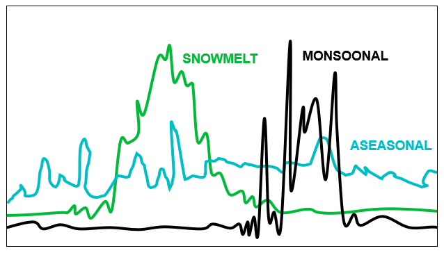
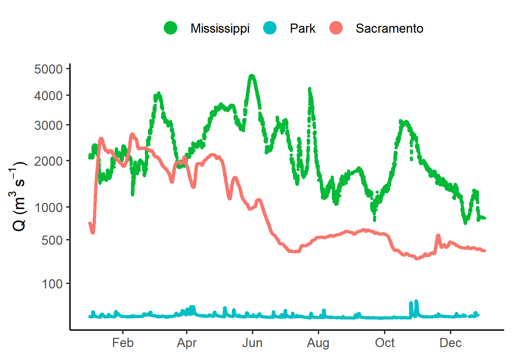
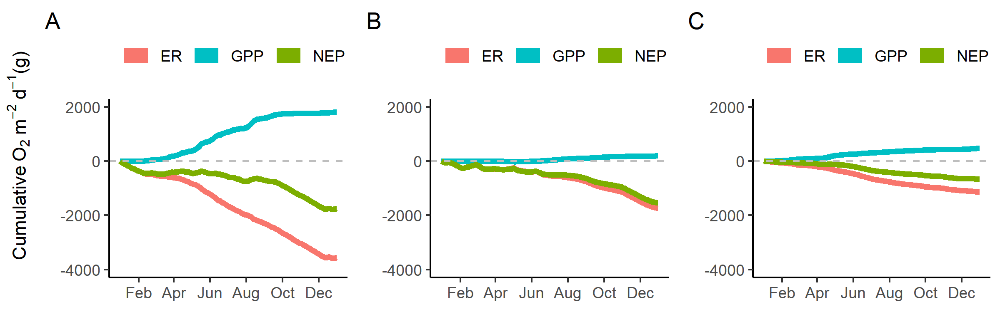

```{r setup, echo = FALSE, warning = FALSE, message = FALSE}
# load metabolizerhelper package, a local package
# filepath is reproducable if user has cloned entire gitHub repo, and working directory is set to repo root
#
#devtools::install_local(path = "./PackagesHW/metabolizerhelper")
library(metabolizerhelper)
library(ggplot2)
library(dplyr)
library(grid)
library(gridExtra)
```

```{r mississippi_modeling, echo = FALSE, warning = FALSE, message = FALSE}
# Mississippi River at Clinton IA, USGS gage number 05420500
#
# load data ------------------------------------------------------------
filepath_IA <- "./FinalProject/input_data/IA_MississippiR.csv"
lat_IA <- "41.780556"
long_IA <- "-90.251944"
tz_IA <- "America/Chicago"
MississippiR_raw <- dataLoad(filepath = filepath_IA, lat = lat_IA, long = long_IA, tz = tz_IA)
#
# reformat data ----------------------------------------------------------
MississippiR <- dataPrep(MississippiR_raw)
#
# run metabolism model ---------------------------------------------------
model_Mississippi <- 
  metabolismModeling(MississippiR, 
                     filename = "./FinalProject/output_data/MississippiR_MetabolismModel.csv")
```

```{r sacramento_modeling, echo = FALSE, warning = FALSE, message = FALSE}
# Sacramento River at Freeport CA, USGS gage number 11447650
#
# load data ------------------------------------------------------------
filepath_CA <- "./FinalProject/input_data/CA_SacramentoR.csv"
lat_CA <- "38.456111"
long_CA <- "-121.500278"
tz_CA <- "America/Los_Angeles"
SacramentoR_raw <- dataLoad(filepath = filepath_CA, lat = lat_CA, long = long_CA, tz = tz_CA)
#
# reformat data ----------------------------------------------------------
SacramentoR <- dataPrep(SacramentoR_raw)
#
# run metabolism model ---------------------------------------------------
model_Sacramento <- 
  metabolismModeling(SacramentoR, 
                     filename = "./FinalProject/output_data/SacramentoR_MetabolismModel.csv")
```

```{r connecti_modeling, echo = FALSE, warning = FALSE, message = FALSE}
# North Branch of the Park River in Hartford, Conneticut USGS gage number 01191000
#
# load data ------------------------------------------------------------
filepath_CT <- "./FinalProject/input_data/CT_NorthBranchParkR.csv"
lat_CT <- "41.784439"
long_CT <- "-72.708056"
tz_CT <- "America/New_York"
NorthBranch_raw <- dataLoad(filepath = filepath_CT, lat = lat_CT, long = long_CT, tz = tz_CT)
#
# reformat data ----------------------------------------------------------
NorthBranch <- dataPrep(NorthBranch_raw)
#
# run metabolism model ---------------------------------------------------
model_NorthBranch <- 
  metabolismModeling(NorthBranch, 
                     filename = "./FinalProject/output_data/NorthBranch_MetabolismModel.csv")
```

```{Q_plot, echo = FALSE, warning = FALSE}
# plot discharge vs dateTime
Q_plot <- 
  ggplot() +
    geom_point(data = MississippiR_raw, size = 0.7,
               aes(x = dateTime, y = Discharge_m3s, color = "Mississippi")) +
    geom_point(data = SacramentoR_raw, size = 0.7,
               aes(x = dateTime, y = Discharge_m3s, color = "Sacramento")) +
    geom_point(data = NorthBranch_raw, size = 0.7,
               aes(x = dateTime, y = Discharge_m3s, color = "Park")) +
    labs(x = NULL, y = bquote("Q ("*m^3~s^-1*")")) +
    scale_color_manual(values = c("#00BA38", "#00BFC4", "#F8766D")) +
    scale_y_continuous(trans = "sqrt", breaks = c(100, 500, 1000, 2000, 3000, 4000, 5000)) +
    scale_x_datetime(date_breaks = "2 months", date_labels = "%b") +
    guides(color = guide_legend(override.aes = list(size = 4), title = NULL)) +
    theme_classic() + theme(legend.position = "top")
# save plot to png file
ggsave(file = "./FinalProject/figures/Qplot.png", Q_plot, width = 5, height = 3.5)
```

```{r NEP, echo = FALSE, warning = FALSE}
# compute cumulative GPP, ER, and NEP for each site ----------------------
source("./FinalProject/NEP_Calcs.R")
#
# plot cumulative GPP, ER, and NEP at each site --------------------------
source("./FinalProject/NEP_Plotter.R")
#
# use NEP_plotter on NEP dataframes --------------------------------------
NEP_Missip_plot <- 
  NEP_plotter(NEP_Missip, legend_pos = "top", c(-4000, 2000)) + 
  labs(tag = "A", y = NULL)
NEP_Sacr_plot <- 
  NEP_plotter(NEP_Sacr, legend_pos = "top", c(-4000, 2000)) + 
  labs(tag = "B", y = NULL)
NEP_Park_plot <- 
  NEP_plotter(NEP_Park, legend_pos = "top", c(-4000, 2000)) + 
  labs(tag = "C", y = NULL)
#
# assemble textGrob for y-axis label 
ylabel_NEP <- 
  textGrob(expression(paste("Cumulative", ~O[2]~m^-2~d^-1, "(g)")), 
           rot = 90, gp = gpar(cex = 0.9))
#
# combine plots using arrangeGrob
NEPgrob <- 
  arrangeGrob(NEP_Missip_plot, NEP_Sacr_plot, NEP_Park_plot, 
              ncol = 3, nrow = 1, left = ylabel_NEP)
# save combined plot to png file
ggsave(file = "./FinalProject/figures/NEPplot.png", NEPgrob, width = 8, height = 2.5)
```

# Introduction

Ecosystem metabolism is a key indicator of the trophic structure, carbon cycling rates, and organic matter content within a system. The conversion rate of solar energy to organic energy within an ecosystem is termed gross primary productivity (GPP), and can be measured as oxygen produced per day. The consumption of this organic energy, by both autotrophs and heterotrophs, is termed ecosystem respiration (ER). The balance between GPP and ER is referred to as net ecosystem production (NEP), and can be used as an indicator of whether a system is net producing or consuming carbon [@Odum1956; @Woodwell1968].  

In terrestrial systems, NEP often follows a predictable annual cycle. GPP and NEP tend to peak during warm, wet summer months, when conditions are most favorable for photosynthetic growth. Lakes also tend to follow this cycle; summertime light availability, higher water temperatures, and available dissolved nutrients creates the ideal cocktail for algae, moss, and macrophyte growth [@Woodwell1968].  
```{r bernhardt, echo = FALSE, fig.cap="Conceptual yearly hydrographs for rivers experiencing aseasonal rain dynamics, a mid-year monsoon season, and a spring snowmelt (adapted from Bernhardt et al. 2018). \\label{bernhardt}", out.height="20%", fig.align = "center"}

```
However, primary production in rivers doesn't often follow the terrestrial growing season. In small streams, light availability decreases in summer, as canopy leaf-out prevents light from reaching surface water. Variations in stream flow, which can be caused by rain events, snow melt, or drought, scour or desiccate stream beds, reducing the biomass of primary producers. Stream hydrology can follow a yearly pattern, but vary widely between biomes [Figure \ref{bernhardt}]. Furthermore, reaches may also receive a significant carbon input from non-aquatic sources, such as an influx of leaf litter during Autumn, or the flushing of soil-bound organic matter during rain events [@Vannote1980]. Carbon input from terrestrial sources can equal or exceed yearly GPP, blurring the seasonal pattern of GPP and ER [@Bernhardt2018].  

As stream size increases, annual ecosystem productivity is less effected by reach morphology, and is more strongly correlated with the terrestrial growing season. In wide, open rivers, canopy cover ceases to be a limiting factor. Water velocity decreases with increasing channel width, reducing scouring, even under the same hydrologic regimes [@Leopold1953]. In large rivers, terrestrial organic matter tends to make up a smaller fraction of the system's total dissolved organic matter [@Vannote1980].  

Recently, Bernhardt et. al proposed a conceptual framework of stream "metabolic regimes", suggesting dominant annual patterns of GPP and ER dynamics for river ecosystems subjected to similar physical and biochemical conditions [-@Bernhardt2018]. We propose to "ground-truth" the metabolism regime concept by asking (1) do we see these proposed regimes in real stream data, and (2) can use an annual metabolic profile to "diagnose" local stream conditions, such as annual precipitation patterns, stream size, or surrounding land use?  

# Methods

## Site details and raw data

We selected three study systems: the Mississippi River (Clinton, IA), the Sacramento River (Freeport, CA), and the North Branch of the Park River (Hartford, CT). These sites differ in river size, surrounding land use, and climate regime, but are located at similar latitudes, to account for overall differences in light intensity [Table 1]. Data spanning from January 1 - December 31, 2017 was obtained from the United States Geological Survey (USGS) National Water Information System database (waterdata.usgs.gov/nwis).  

|Characteristic                 |Park              |Sacramento          |Mississippi              |
|:------------------------------|:-----------------|:-------------------|:------------------------|
|Site location (latitude)       |41°47'04.0"N      |38°27'22.0"N        |41°46'50.0"N             |
|Site location (longitude)      |72°42'29.0"W      |121°30'01.0"W       |90°15'07.0"W             |
|USGS gage number               |01191000          |11447650            |05420500                 |
|Watershed drainage area (km^2^)|69.4              |68,600              |221,000                  |
|Precipitation regime           |Aseasonal         |Winter (Jan-Feb)    |Spring/Summer (Apr-Jul)  |
|Dominant land use              |Forested, urban   |Urban, agriculture  |Agriculture              |
|Mean Q (m^3^ s^-1^) (min-max)  |0.436 (0.056-25.6)|1070 (289-2730)     |2340 (728-4730)          |
|Mean T (&deg;C) (min-max)      |11 (0.0-27)       |15 (7.9-23)         |13 (0.9-28)              |
|Mean turbidity (FNU) (min-max) |7.48 (0.9-584)    |19.5 (3.40-129)     |22.2 (2.4-256)           |
|Mean N (mg-N L^-1^) (min-max)  |NA                |0.15 (0.08-0.51)    |2.4 (0.44-3.7)           |

Table: Site characteristics of Park, Sacramento, and Mississippi River stations for 2017. Precipitation regime based on 2017 NOAA data. Land use based on USDA land cover maps. N data was not available for Park (= NA). Q = discharge, T = temperature, N = nitrate plus nitrite, min = minimum, max = maximum.

Stream discharge, water temperature, and dissolved oxygen were measured at 15 minute intervals. Any data points (due to sensor malfunction) were estimated via interpolation, using the `na.seasplit` function from the `imputeTS` R package [@imputeTS; @R]. This function seasonally decomposes time series data, and performs imputation separately for each resulting seasonal chunk. This interpolation method is the same as that used by the `streamPULSE` team, a national stream metabolism research group [@StreamPULSE].  

\begin{align} 
d = c ~ Q^f 
\end{align}

Photosynthetically active radiation (PAR) was estimated using the `streamMetabolizer` R package function `calc_light`, based on site latitude, day of year, and time, as local (<100 km) solar irradiance data was not available [@streamMetabolizer]. Dissolved oxygen saturation was directly measured at each site, so it was not necessary to model oxygen reaeration rates. River depth (d) was back-calculated from instantaneous discharge data (Eq. 1). Where the theoretical coefficient of depth at unit discharge (c, 0.409 m) is multiplied by discharge (Q, m^3^ s^-1^), raised to the power of the theoretical exponent of depth at unit discharge (f, 0.294) [see @Leopold1953; @Raymond2012].  

## Metabolism modeling

A Markov chain Monte Carlo (MCMC) model was fit with the `streamMetabolizer` R package, using 4 chains of 1000 steps each (500 burn-in, 500 saved) [@streamMetabolizer]. A Bayesian model has considerable advantage over standard calculation methods [see @Odum1956], as it can allow for a dynamic relationship between air-water gas exchange coefficients and discharge data. This creates a better approximation of real-world conditions, and considerably reduces the amount of error traditionally observed in multi-day metabolism estimates [@Appling2018]. Cumulative gross primary productivity (GPP) and ecosystem respiration (ER) was computed by taking a step wise sum of daily GPP and ER, respectively. Cumulative net ecosystem productivity (NEP) was then found by taking the step wise sum of GPP and ER [@Odum1956].  

# Results  

In general, trends in river discharge followed annual precipitation trends. Mississippi discharge rates ranged from about 1000 to 5000 m^3^ s^-1^. As the flow of the Mississippi is altered by dams and lock systems, it is more difficult to separate the effect of precipitation from the effect of manipulated flow regulation. Sacramento, in contrast, has defined "high flow" (2000 m^3^ s^-1^, Jan-Jun) and "low flow" (500 m^3^ s^-1^, Jul-Dec) regimes, that more closely follow the rainy season (Jan-Feb). Discharge at Park is flashy and does not seem to follow a strong seasonal pattern [Figure \ref{Q_plot}].

```{r Q_plot_load, echo = FALSE, out.height="30%",fig.align="center",fig.cap="Annual stream discharge (Q) in the Mississippi River (green), Park River (blue), and Sacramento River (pink) for 2017. Each point represents one measurement.\\label{Q_plot}"}

```

```{r Q_GPP_ER, echo = FALSE, warning = FALSE, ,message=FALSE, fig.width=6, fig.height=4, fig.cap="Relationship of discharge (Q) to gross primary production (GPP) (A, B, C) and ecosystem respiration (ER) (D, E, F) in the Mississippi (A, D), Sacramento (B, E), and Park River (C, F) during 2017. Each point represents a daily average.\\label{PAR_Q}"}
source("./FinalProject/Q_GPP_ER_Plotter.R")
```

GPP, ER, and NEP rates varied temporally in all rivers [Figures \ref{mississippi_plotting}, \ref{sacr_plotting}, \ref{connecti_plotting}, \ref{NEPplot}]. In the Mississippi, GPP was near 0 during cold months (Jan-Mar, Oct-Dec), and ranged from 5-23 g O_2_ m^-2^ d^-1^ during the peak growing season (Apr-Sep) [Figure \ref{mississippi_plotting}]. GPP did take a sharp dive from mid-June through the end of July, which could be related to a hydrograph peak and potential scouring event in early June [Figure \ref{Q_plot}]. In general, ER was low, but confidence intervals were large [Figure \ref{mississippi_plotting}]. Stream discharge was significantly correlated with both GPP and ER rate  (p-value = $`r summary(lm(GPP.Missip ~ Q.Missip, data = Q_GPP_ER))$coefficients[2,4]`$, $`r summary(lm(ER.Missip ~ Q.Missip, data = Q_GPP_ER))$coefficients[2,4]`$ [Figure \ref{PAR_Q}]. The Mississippi had the lowest cumulative ER and highest cumulative GPP of all study systems [Figure \ref{NEPplot}].

```{r mississippi_plotting, fig.height=3, fig.width = 8, echo = FALSE, warning = FALSE, fig.cap="Estimate of gross primary productivity (GPP) and ecosystem respiration (ER) in the Mississippi River during 2017.\\label{mississippi_plotting}"}
metabolismPlot(model_Mississippi, 
               filename = "./FinalProject/figures/MississippiR_MetabolismModel.png")
```

In the Sacramento River, GPP was near 0 year-round. ER rates were variable and periodically positive during winter and spring (Jan-Jun), when discharge rates were elevated compared to the latter half of the year [Figures \ref{sacr_plotting}, \ref{Q_plot}]. Regression analysis confirmed that stream discharge was correlated with both GPP and ER rate (p-value = $`r summary(lm(GPP.Sacr ~ Q.Sacr, data = Q_GPP_ER))$coefficients[2,4]`$, $`r summary(lm(ER.Sacr ~ Q.Sacr, data = Q_GPP_ER))$coefficients[2,4]`$) [Figure \ref{PAR_Q}]. The Sacramento was the least productive of all study systems, with cumulative NEP only slightly offset from cumulative ER [Figure \ref{NEPplot}].  

```{r sacramento_plotting, fig.height=3, fig.width = 8, echo = FALSE, warning = FALSE, fig.cap="Estimate of gross primary productivity (GPP) and ecosystem respiration (ER) in the Sacramento River during 2017. \\label{sacr_plotting}"}
metabolismPlot(model_Sacramento, 
               filename = "./FinalProject/figures/SacramentoR_MetabolismModel.png")
```

```{r NEP_plotting, echo = FALSE, fig.cap="Cumulative net ecosystem productivity (NEP), ecosystem respiration (ER), gross primary production (GPP) rates in the Mississippi (A), Sacramento (B), and Park Rivers (C) during 2017. Note that y-axis scales differ.\\label{NEPplot}", out.width="100%"}

```

Peak productivity in the Park River occurred in early spring (Apr-Jun), with production rates ranging from 2-8 g O_2_ m^-2^ d^-1^ during that time. Peak respiration rate occurred in summer (Jun), with spikes also occurring in fall (Oct, Nov) [Figure \ref{connecti_plotting}]. Primary productivity was significantly correlated with stream discharge (p-value = $`r summary(lm(GPP.Park ~ Q.Park, data = Q_GPP_ER))$coefficients[2,4]`$), despite (or because of) high variability in Q [Figure \ref{PAR_Q}]. The cumulative GPP and ER profile was symmetric throughout the year, and cumulative NEP was the largest across all study sites.

```{r connecti_plotting, fig.height=3, fig.width = 8, echo = FALSE, warning = FALSE, fig.cap="Estimate of gross primary productivity (GPP) and ecosystem respiration (ER) in the Park River during 2017. \\label{connecti_plotting}"}
metabolismPlot(model_NorthBranch, 
               filename = "./FinalProject/figures/NorthBranch_MetabolismModel.png")
```

# Discussion

The metabolism regime of the Mississippi River most closely followed the terrestrial growing season, due to a number of factors. First, the Mississippi had extremely high nitrogen concentrations for most of the year. This allowed for optimized growth conditions, compensating for dampening in GPP that may have occurred due to high turbidity and variable flow conditions. In contrast, the Sacramento was subject to similarly turbid conditions, but nitrogen concentrations were much more limited. The effect of these dual-dampening factors was to reduce GPP to near zero for the entire study period. This suggests that nutrient availability is a domineering control on metabolic rate. The Park River was highly productive for it's size; it had a cumulative NEP equal to 25% of the Mississippi, while having less than 2% of the discharge [Figure \ref{NEPplot}]. While GPP rates in the Mississippi far exceed those in the Park, the relative ratio of GPP:ER in the Mississippi is less than 1. Ultimately, this indicates that the Mississippi is a net heterotrophic community, while the Park (GPP:ER > 1) is net autotrophic. Generally, GPP:ER ratios in small, forested streams are autotrophic, while larger rivers tend to be heterotropic [@Odum1956; @Bernhardt2018].

Confidence intervals on ER estimates were the widest on the Mississippi, which may indicate that model assumptions for gas transfer dynamics are being violated or poorly approximated. To improve these estimates, the model could be calibrated with measured gas transfer rates. Respiration rates in the Sacramento become positive in February, late March, and April, which may indicate a significant input of organic carbon to the reach. This may be caused by increased precipitation, as overland flow washes organic particulates from the soil and into streams. In the future, daily precipitation data could be compared to ER estimates to further understand this potential link [similar to Figure \ref{PAR_Q}].  

This preliminary proof suggests that ambient nutrient concentration and stream discharge may be the strongest factors influencing the metabolic regimes of flowing waters. We conclude that varying metabolic profiles are evident even within a small sample of stream data, as is displayed here, and verify the trends and predictions made by Bernhardt et. al hold true thus far [-@Bernhardt2018]. In terms of "diagnosing" local stream conditions from a single metabolic profile, we propose that this may be possible, with some caveats. There are many competing factors that influence a metabolism profile, making it difficult to conclusively determine the cause of a depressed or elevated signal without some amount of supporting information. 

# References  
