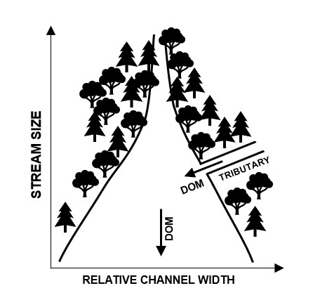

```{r setup, echo = FALSE, warning = FALSE, message = FALSE}
# load metabolizerhelper package, a local package
# filepath is reproducable if user has cloned entire gitHub repo, and working directory is set to repo root
#
#devtools::install_local(path = "./PackagesHW/metabolizerhelper")
library(metabolizerhelper)
library(ggplot2)
library(dplyr)
library(grid)
library(gridExtra)
```

```{r mississippi_modeling, echo = FALSE, warning = FALSE, message = FALSE}
# Mississippi River at Clinton IA, USGS gage number 05420500
#
# load data ------------------------------------------------------------
filepath_IA <- "./FinalProject/input_data/IA_MississippiR.csv"
lat_IA <- "41.780556"
long_IA <- "-90.251944"
tz_IA <- "America/Chicago"
MississippiR_raw <- dataLoad(filepath = filepath_IA, lat = lat_IA, long = long_IA, tz = tz_IA)
#
# reformat data ----------------------------------------------------------
MississippiR <- dataPrep(MississippiR_raw)
#
# run metabolism model ---------------------------------------------------
model_Mississippi <- 
  metabolismModeling(MississippiR, 
                     filename = "./FinalProject/output_data/MississippiR_MetabolismModel.csv")
```

```{r sacramento_modeling, echo = FALSE, warning = FALSE, message = FALSE}
# Sacramento River at Freeport CA, USGS gage number 11447650
#
# load data ------------------------------------------------------------
filepath_CA <- "./FinalProject/input_data/CA_SacramentoR.csv"
lat_CA <- "38.456111"
long_CA <- "-121.500278"
tz_CA <- "America/Los_Angeles"
SacramentoR_raw <- dataLoad(filepath = filepath_CA, lat = lat_CA, long = long_CA, tz = tz_CA)
#
# reformat data ----------------------------------------------------------
SacramentoR <- dataPrep(SacramentoR_raw)
#
# run metabolism model ---------------------------------------------------
model_Sacramento <- 
  metabolismModeling(SacramentoR, 
                     filename = "./FinalProject/output_data/SacramentoR_MetabolismModel.csv")
```

```{r connecti_modeling, echo = FALSE, warning = FALSE, message = FALSE}
# North Branch of the Park River in Hartford, Conneticut USGS gage number 01191000
#
# load data ------------------------------------------------------------
filepath_CT <- "./FinalProject/input_data/CT_NorthBranchParkR.csv"
lat_CT <- "41.784439"
long_CT <- "-72.708056"
tz_CT <- "America/New_York"
NorthBranch_raw <- dataLoad(filepath = filepath_CT, lat = lat_CT, long = long_CT, tz = tz_CT)
#
# reformat data ----------------------------------------------------------
NorthBranch <- dataPrep(NorthBranch_raw)
#
# run metabolism model ---------------------------------------------------
model_NorthBranch <- 
  metabolismModeling(NorthBranch, 
                     filename = "./FinalProject/output_data/NorthBranch_MetabolismModel.csv")
```

```{Q_plot, echo = FALSE, warning = FALSE}
# plot discharge vs dateTime
Q_plot <- 
  ggplot() +
    geom_point(data = MississippiR_raw, size = 0.7,
               aes(x = dateTime, y = Discharge_m3s, color = "Mississippi")) +
    geom_point(data = SacramentoR_raw, size = 0.7,
               aes(x = dateTime, y = Discharge_m3s, color = "Sacramento")) +
    geom_point(data = NorthBranch_raw, size = 0.7,
               aes(x = dateTime, y = Discharge_m3s, color = "Park")) +
    labs(x = NULL, y = bquote("Q ("*m^3~s^-1*")")) +
    scale_color_manual(values = c("#00BA38", "#00BFC4", "#F8766D")) +
    scale_y_continuous(trans = "sqrt", breaks = c(100, 500, 1000, 2000, 3000, 4000, 5000)) +
    scale_x_datetime(date_breaks = "2 months", date_labels = "%b") +
    guides(color = guide_legend(override.aes = list(size = 4), title = NULL)) +
    theme_classic() + theme(legend.position = "top")
# save plot to png file
ggsave(file = "./FinalProject/figures/Qplot.png", Q_plot, width = 5, height = 3.5)
```

```{r NEP, echo = FALSE, warning = FALSE}
# compute cumulative GPP, ER, and NEP for each site ----------------------
source("./FinalProject/NEP_Calcs.R")
#
# plot cumulative GPP, ER, and NEP at each site --------------------------
source("./FinalProject/NEP_Plotter.R")
#
# use NEP_plotter on NEP dataframes --------------------------------------
NEP_Missip_plot <- 
  NEP_plotter(NEP_Missip, legend_pos = "top", breaks = c(-3000, -1500, 0, 1500)) + 
  labs(tag = "A", y = NULL)
NEP_Sacr_plot <- 
  NEP_plotter(NEP_Sacr, legend_pos = "top") + 
  labs(tag = "B", y = NULL)
NEP_Park_plot <- 
  NEP_plotter(NEP_Park, legend_pos = "top") + 
  labs(tag = "C", y = NULL)
#
# assemble textGrob for y-axis label 
ylabel_NEP <- 
  textGrob(expression(paste("Cumulative", ~O[2]~m^-2~d^-1, "(g)")), 
           rot = 90, gp = gpar(cex = 0.9))
#
# combine plots using arrangeGrob
NEPgrob <- 
  arrangeGrob(NEP_Missip_plot, NEP_Sacr_plot, NEP_Park_plot, 
              ncol = 3, nrow = 1, left = ylabel_NEP)
# save combined plot to png file
ggsave(file = "./FinalProject/figures/NEPplot.png", NEPgrob, width = 8, height = 2.5)
```

# Introduction

Ecosystem metabolism is a key indicator of the trophic structure, carbon cycling rates, and organic matter content within a system. The conversion rate of solar energy to organic energy within an ecosystem is termed gross primary productivity (GPP), and can be measured as oxygen produced per day. The consumption of this organic energy, by both autotrophs and heterotrophs, is termed ecosystem respiration (ER). The balance between GPP and ER is referred to as net ecosystem production (NEP), and can be used as an indicator of whether a system is net producing or consuming carbon [@Odum1956; @Woodwell1968].  

In terrestrial systems, NEP often follows a predictable annual cycle. GPP and NEP tend to peak during warm, wet summer months, when conditions are most favorable for photosynthetic growth. Lakes also tend to follow this cycle; summertime light availability, higher water temperatures, and available dissolved nutrients creates the ideal cocktail for algae, moss, and macrophyte growth [@Woodwell1968].  

However, primary production in rivers doesn't often follow the terrestrial growing season. In small streams, light availability decreases in summer, as canopy leaf-out prevents light from reaching surface water. Variations in stream flow, which can be caused by rain events, snow melt, or drought, scour or desiccate stream beds, reducing the biomass of primary producers. Stream hydrology can follow a yearly pattern, but vary widely between biomes [Figure \ref{bernhardt}]. Furthermore, reaches may also receive a significant carbon input from non-aquatic sources, such as an influx of leaf litter during Autumn, or the flushing of soil-bound organic matter during rain events [@Vannote1980]. Carbon input from terrestrial sources can equal or exceed yearly GPP, blurring the seasonal pattern of GPP and ER [@Bernhardt2018].

```{r bernhardt, echo = FALSE, fig.cap="Conceptual yearly hydrographs for rivers experiencing aseasonal rain dynamics, a mid-year monsoon season, and a spring snowmelt (adapted from Bernhardt et al. 2018). \\label{bernhardt}", out.height="20%", fig.align = "center"}
knitr::include_graphics("../FinalProject/figures/Bernhardt2018.PNG")
```

As stream size increases, annual ecosystem productivity is less effected by reach morphology, and is more strongly correlated with the terrestrial growing season. In wide, open rivers, canopy cover ceases to be a limiting factor [Figure \ref{vannote}]. Water velocity decreases with increasing channel width, reducing scouring, even under the same hydrologic regimes [@Leopold1953]. In large rivers, terrestrial organic matter tends to make up a smaller fraction of the system's total dissolved organic matter [@Vannote1980].

```{r vannote, echo = FALSE, fig.cap="The relationship between stream size and stream attributes (adapted from Vannote et al. 1980). \\label{vannote}", out.height="30%", fig.align='center'}

```

Recently, Bernhardt et. al proposed a conceptual framework of stream "metabolic regimes", suggesting dominant annual patterns of GPP and ER dynamics for river ecosystems subjected to similar physical and biochemical conditions [-@Bernhardt2018]. We propose to "ground-truth" the metabolism regime concept by asking (1) do we see these proposed regimes in real stream data, and (2) can use an annual metabolic profile to "diagnose" local stream conditions, such as annual precipitation patterns, stream size, or surrounding land use?  

# Methods

## Site details and raw data

We selected the Mississippi River (Clinton, IA), the North Branch of the Park River (Hartford, CT), and the Sacramento River (Freeport, CA), for this analysis. These sites are located at similar latitudes to account for overall differences in light intensity, but have differences in river size, land use, and climate regime. Data was provided by the United States Geological Survey (USGS) National Water Information System database (waterdata.usgs.gov/nwis), and spanned from January 1, 2017 to November 1, 2017. Stream discharge, water temperature, and dissolved oxygen were measured at 15 minute intervals from January 1, 2017 to December 31, 2017 at the Sacramento and Park River sites, and thru November 1, 2017 at the Mississippi River site due to ice cover.  

|Characteristic                 |Park              |Sacramento          |Mississippi              |
|:------------------------------|:-----------------|:-------------------|:------------------------|
|Site location (latitude)       |41°47'04.0"N      |38°27'22.0"N        |41°46'50.0"N             |
|Site location (longitude)      |72°42'29.0"W      |121°30'01.0"W       |90°15'07.0"W             |
|USGS gage number               |01191000          |11447650            |05420500                 |
|Watershed drainage area (km^2^)|69.4              |68,600              |221,000                  |
|Precipitation regime           |Aseasonal         |Winter (Jan-Feb)    |Spring/Summer (Apr-Jul)  |
|Dominant land use              |Forested, urban   |Urban, agriculture  |Agriculture              |
|Mean Q (m^3^ s^-1^) (min-max)  |0.436 (0.056-25.6)|1070 (289-2730)     |2340 (728-4730)          |
|Mean T (&deg;C) (min-max)      |11 (0.0-27)       |15 (7.9-23)         |13 (0.9-28)              |
|Mean turbidity (FNU) (min-max) |7.48 (0.9-584)    |19.5 (3.40-129)     |22.2 (2.4-256)           |
|Mean N (mg-N L^-1^) (min-max)  |NA                |0.15 (0.08-0.51)    |2.4 (0.44-3.7)           |

Table: Site characteristics of Park, Sacramento, and Mississippi River stations for 2017. Precipitation regime based on 2017 NOAA data. Land use based on USDA land cover maps. N data was not available for Park (= NA). Q = discharge, T = temperature, N = nitrate plus nitrite, min = minimum, max = maximum.

Photosynthetically active radiation (PAR) was estimated using time and latitude. A more common (and accurate) approach would be to use PAR data collected at a local solar irradiance monitoring station, or collected by a portable in-field sensor. For the purposes of this preliminary proposal, we chose an estimation technique for a quick proof of concept. Depth data was back-calculated from instantaneous discharge measurements using $\ d = c Q^f $, where depth (d) is equal to the theoretical coefficient of depth at unit discharge (c, 0.409 m) multiplied by discharge (Q, m^3^ s^-1^) to the power of the theoretical exponent of depth at unit discharge (f, 0.294) [see @Leopold1953; @Raymond2012].  

Missing data points were filled via interpolation, using `na.seasplit` function from the `imputeTS` R package [@imputeTS; @R]. This function seasonally decomposes time series data, and performs imputation seperately for each resulting seasonal chunk. This interpolation method is the same as that used by the `streamPULSE` team, a national stream metabolism research group [@StreamPULSE].

## Metabolism modeling

We used the `streamMetabolizer` R package to fit a Markov chain Monte Carlo (MCMC) model to the data, using 500 samples for a warmup and 500 samples to fit the model (1000 total samples) [@streamMetabolizer]. For this preliminary report, the metabolism model was fit to the Mississippi River site only. Standard methods for the direct calculation of GPP, ER, and NEP [see @Odum1956] can't allow for changing air-water gas exchange dynamics with changing discharge, which introduces considerable error into multi-day metabolism estimates [@Appling2018].  

# Results  

Values of GPP and ER both temporally varied, but GPP estimates were most dependent upon season. It is likely that GPP may be correlated with T, PAR, and Q, but this analysis has not yet been completed. In the Mississippi, GPP was lowest during colder months (January-March and October-November), and with the exception of a decrease in GPP in early July, closely follows the terrestrial growing season. Confidence intervals on ER estimates were much wider than those on GPP estimates, especially during colder months [Figure \ref{metab_plot}]. A similar analysis of the lower Mississippi River (Baton Rouge, LA) shows a negative correlation between PAR and GPP, and suggests that PAR may be indirectly related to disturbance effects, as maximum PAR and highest Q co-occured during late summer [@Dodds2013].

```{r Q_plot_load, echo = FALSE, out.height="30%",fig.align="center",fig.cap="Annual stream discharge (Q) in the Mississippi River (green), Park River (blue), and Sacramento River (pink) for 2017. Each point represents one measurement.\\label{Q_plot}"}
knitr::include_graphics("../FinalProject/figures/Qplot.png")
```

```{r Q_GPP_ER, echo = FALSE, warning = FALSE, ,message=FALSE, fig.width=6, fig.height=4, fig.cap="Relationship of discharge (Q) to gross primary production (GPP) (A, B, C) and ecosystem respiration (ER) (D, E, F) in the Mississippi (A, D), Sacramento (B, E), and Park River (C, F) during 2017. Each point represents a daily average.\\label{PAR_Q}"}
source("./FinalProject/Q_GPP_ER_Plotter.R")
```

```{r mississippi_plotting, fig.height=3, fig.width = 8, echo = FALSE, warning = FALSE, fig.cap="Estimate of gross primary productivity (GPP) and ecosystem respiration (ER) in the Mississippi River during 2017.\\label{mississippi_plotting}"}
metabolismPlot(model_Mississippi, 
               filename = "./FinalProject/figures/MississippiR_MetabolismModel.png")
```

```{r sacramento_plotting, fig.height=3, fig.width = 8, echo = FALSE, warning = FALSE, fig.cap="Estimate of gross primary productivity (GPP) and ecosystem respiration (ER) in the Sacramento River during 2017. \\label{sacr_plotting}"}
metabolismPlot(model_Sacramento, 
               filename = "./FinalProject/figures/SacramentoR_MetabolismModel.png")
```

```{r connecti_plotting, fig.height=3, fig.width = 8, echo = FALSE, warning = FALSE, fig.cap="Estimate of gross primary productivity (GPP) and ecosystem respiration (ER) in the Park River during 2017. \\label{connecti_plotting}"}
metabolismPlot(model_NorthBranch, 
               filename = "./FinalProject/figures/NorthBranch_MetabolismModel.png")
```

```{r NEP_plotting, echo = FALSE, fig.cap="Cumulative net ecosystem productivity (NEP), ecosystem respiration (ER), gross primary production (GPP) rates in the Mississippi (A), Sacramento (B), and Park Rivers (C) during 2017. Note that y-axis scales differ.\\label{NEPplot}", out.width="100%"}
knitr::include_graphics("../FinalProject/figures/NEPplot.png")
```

# Discussion

For the final report, we will compare and contrast the metabolism profiles of these three sites, and identify possible predictors for a resultant "regime types". We will also evaluate how ecosystem NEP varies throughout the year.  

Modeling metabolism for a full year and across different rivers will allow us to explore the effects of both seasonal (T, PAR, Q) and environmental (land use, climate) constraints on ecosystem productivity. In the past, metabolism modeling over long time series was rare, due to the energy required to collect and process data. Now, with the advent of cheap in-situ sensors and modeling packages, these analyses are becoming more common. Greater data availability will allow us to have a better understanding of what drives the ecological differences between stream systems. Ultimately, this may allow us to improve our estimates of carbon retention and loss from these systems, and determine the drivers behind both processes.  

# References  
